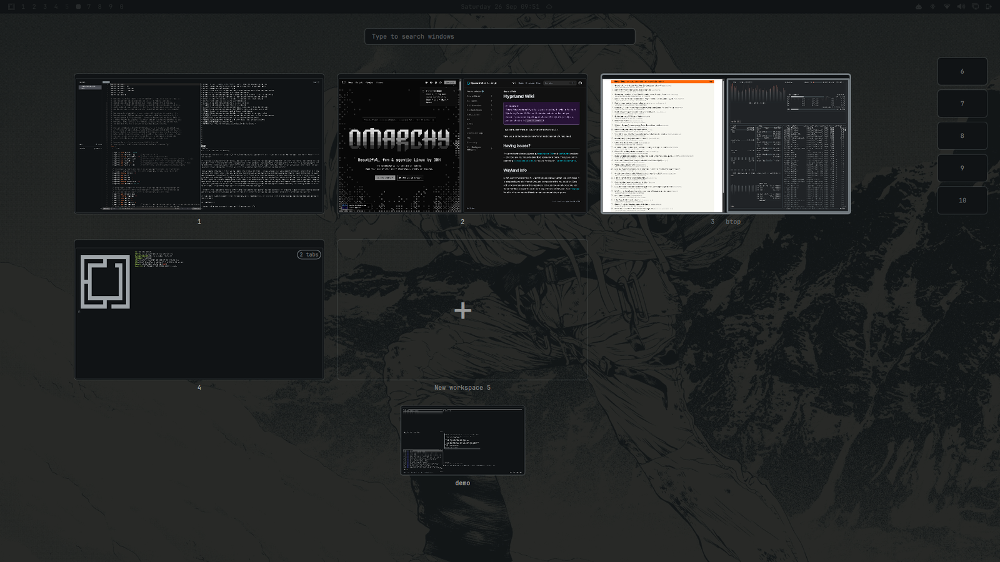
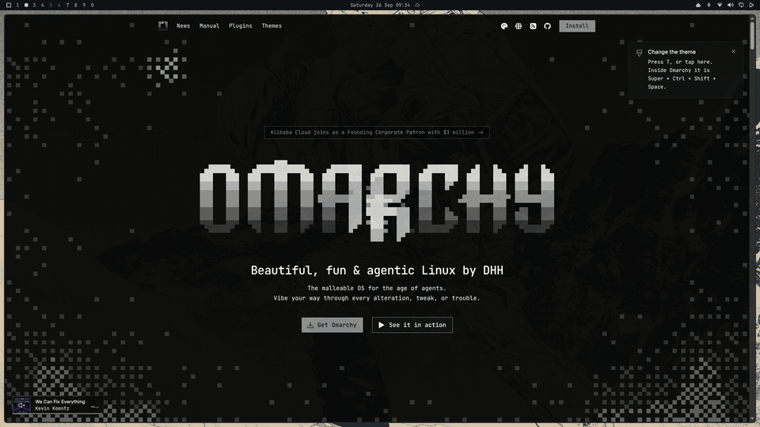
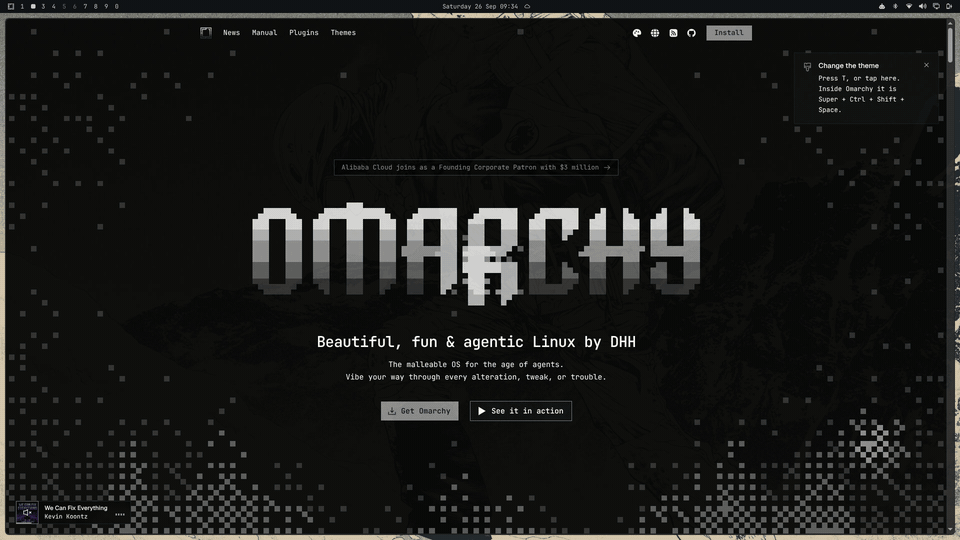
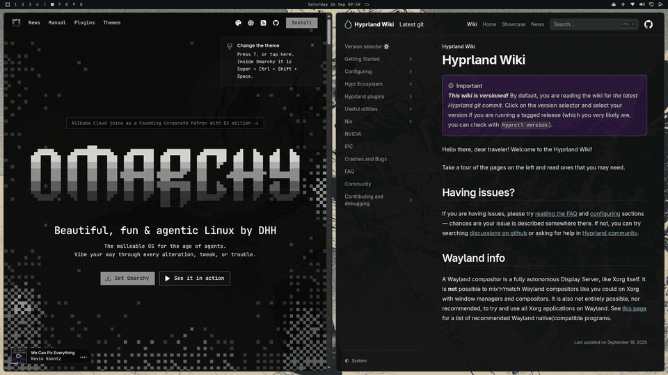
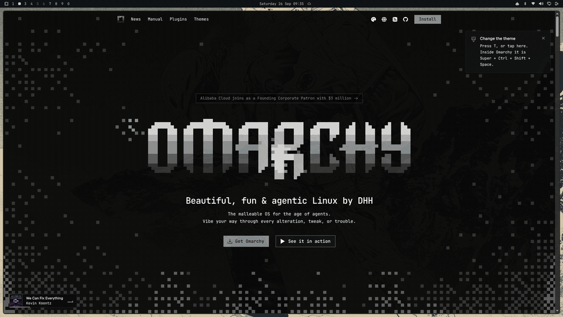

# 4-Finger Overview for Omarchy

A workspace overview for [Omarchy](https://omarchy.org/), opened with a 4-finger swipe up on the trackpad, similar to Mission Control on macOS.



It opens on **every monitor at once**, and each monitor shows its own workspaces that hold at least one window, each drawn as a scaled-down copy of the monitor with live previews of its windows. Each monitor's grid ends with a "+" tile for a new workspace, which takes the lowest workspace number not in use, and a column on the right lists the other unused workspaces from 1 to 10 as small numbered boxes. Using the "+" tile or a box on a monitor puts that workspace on that monitor.

Drag a window onto the "+" tile or an unused box to move it there. The box column is a wide target (anywhere from just left of the boxes to the screen edge), the box under the cursor grows around the window without moving the others, and a tab beside it names the destination ("Workspace 7", "New workspace 12"). Boxes scale with the monitor, so they stay easy to hit on a large screen. Drag it onto any workspace, including its own, to place it next to a specific window: the tiled window under the cursor (or the nearest one) is split, and the window goes on the side of it nearest the cursor (left, right, above or below). While you hover, that window slides over and a slot opens where the dragged window will land, and the workspace the window leaves closes the gap it leaves, the way Hyprland will re-tile it. That also makes reordering inside one workspace preview correctly. A floating window is tiled as it lands. The overview stays open and redraws with the new layout.

Placement uses Hyprland's dwindle layout with `use_active_for_splits` on (the default): on drop the plugin briefly focuses the target window behind the overview, preselects the side, moves the window in, and switches back to the workspace you were on.

It runs as an overlay plugin inside the Omarchy shell (Quickshell), so it picks up your theme's menu colors and font and needs no extra process.

## In action

Open it and move around with the arrow keys:



Type to search by title, app, or the program running inside a window (`nvim` finds the tab group it runs in, `lazygit` the scratchpad):



Drag a window beside another one, or onto "+" for a new workspace:



Or grab it from the keyboard with SUPER+SHIFT+arrows and place it with Enter, which closes the overview with the window focused:



The screenshots and recordings use generic demo workspaces on a virtual monitor.

## Requirements

- Omarchy with the Quickshell-based shell (`omarchy-shell`)
- Hyprland 0.55 or later (Lua config)

## Install

```bash
omarchy plugin add https://github.com/ChrisTeceno/omarchy-4-finger-overview --enable
```

Then add the gestures to `~/.config/hypr/input.lua`:

```lua
-- 3- and 4-finger horizontal swipes switch workspaces.
hl.gesture({ fingers = 3, direction = "horizontal", action = "workspace" })
hl.gesture({ fingers = 4, direction = "horizontal", action = "workspace" })

-- 4-finger swipe up opens or closes the overview, down closes it.
hl.gesture({ fingers = 4, direction = "up", action = function() hl.exec_cmd("omarchy-shell shell toggle christeceno.4-finger-overview") end })
hl.gesture({ fingers = 4, direction = "down", action = function() hl.exec_cmd("omarchy-shell shell hide christeceno.4-finger-overview") end })
```

Hyprland reloads the file on save. Check for mistakes with `hyprctl configerrors`.

Optionally skip Hyprland's fade on the overview's layers, as Omarchy does for its own overlays; it opens a full-screen layer on every monitor, so this trims the work when it opens:

```lua
hl.layer_rule({ match = { namespace = "christeceno-4-finger-overview" }, no_anim = true, animation = "none" })
```

To open it from the keyboard instead, bind a key in `~/.config/hypr/bindings.lua`:

```lua
o.bind("SUPER + TAB", "Overview", "omarchy-shell shell toggle christeceno.4-finger-overview")
```

(SUPER+TAB is taken by default in Omarchy; call `hl.unbind("SUPER + TAB")` first if you want it.)

Hyprland handles its own key bindings before the overview sees the key, so SUPER+arrow, SUPER+SHIFT+arrow and SUPER+K need a small forwarder in `~/.config/hypr/bindings.lua`. These keep Omarchy's usual actions (move focus, swap windows, keybindings menu) and only drive the overview while it is showing:

```lua
local function overview_open()
  return #hl.get_layers({ namespace = "christeceno-4-finger-overview" }) > 0
end

local function overview_send(payload)
  hl.exec_cmd("omarchy-shell shell summon christeceno.4-finger-overview '" .. payload .. "'")
end

-- SUPER+arrows: jump between workspaces in the overview, move focus otherwise.
for key, dir in pairs({ LEFT = "l", RIGHT = "r", UP = "u", DOWN = "d" }) do
  hl.unbind("SUPER + " .. key)
  o.bind("SUPER + " .. key, "Focus " .. key:lower(), function()
    if overview_open() then overview_send('{"jump":"' .. dir .. '"}')
    else hl.dispatch(hl.dsp.focus({ direction = dir })) end
  end)
end

-- SUPER+SHIFT+arrows: grab and move a window in the overview, swap windows otherwise.
for key, dir in pairs({ LEFT = "l", RIGHT = "r", UP = "u", DOWN = "d" }) do
  hl.unbind("SUPER + SHIFT + " .. key)
  o.bind("SUPER + SHIFT + " .. key, "Swap window " .. key:lower(), function()
    if overview_open() then overview_send('{"grab":"' .. dir .. '"}')
    else hl.dispatch(hl.dsp.window.swap({ direction = dir })) end
  end)
end

-- SUPER+K: the overview's shortcut sheet in the overview, Omarchy's keybindings menu otherwise.
hl.unbind("SUPER + K")
o.bind("SUPER + K", "Keybindings", function()
  if overview_open() then overview_send('{"help":true}')
  else hl.exec_cmd("omarchy-menu-keybindings") end
end)
```

## Usage

One window is selected at a time. It starts on the focused window and follows the mouse or the arrow keys; its title shows under its workspace. Typing filters windows by title, app name, or the programs running inside them (so `herdr` or `claude` finds the terminal they run in): matches stay bright, the rest dim, and the arrow keys skip over them.

| Input | Action |
| --- | --- |
| 4-finger swipe up | Open or close |
| 4-finger swipe down, click the background | Close |
| Esc | Cancel a drag, then clear the search, then close |
| Type | Search windows (Backspace edits) |
| Hover a window | Select it |
| Click a window, or Enter | Focus the selected window (Enter on a box goes to that workspace) |
| Click the empty part of a workspace | Switch to that workspace |
| Click "+" or an unused box | Go to a new workspace (lowest free number), or that one |
| Drag a window | Move it next to the window it is dropped on (the side nearest the cursor), or to an unused box or "+" |
| Middle-click a window | Close it |
| Arrow keys | Select the nearest window in that direction, across workspaces and into the unused boxes and "+" |
| SUPER + arrow keys | Jump to the neighbouring workspace, unused box or "+" (needs the forwarder above) |
| SUPER + SHIFT + arrow keys | Grab the selected window and move it between drop spots (each side of every window, empty workspaces, the "+" tile and the unused boxes); after that, plain arrows keep moving it, Enter places it and closes the overview with the window focused, and Esc cancels. Works directly when Hyprland has nothing bound to it; otherwise use the forwarder above |
| SUPER + K | Show or hide the shortcut sheet (needs the forwarder above) |
| Tab, Shift+Tab | Step through every window in order |

## Update and remove

```bash
omarchy plugin update christeceno.4-finger-overview
omarchy restart shell
omarchy plugin remove christeceno.4-finger-overview
```

Restart the shell after an update: this plugin stays loaded, and the shell's hot reload does not replace a loaded plugin's code. Remove the gesture lines from `input.lua` as well when uninstalling.

## Notes

- Scratchpads (special workspaces) that hold windows show as a row of smaller tiles under the regular workspaces of the monitor they belong to, labelled by name. Click one to open it on that monitor, drag windows into and out of it, and search reaches them. A scratchpad that was open stays open after a drop.
- A tab group shows as its active tab with a tab count, and search matches any of its tabs. Dragging a group moves the whole group, as Hyprland does.
- Dropping a window into a workspace with a fullscreen or maximized window takes that window out of fullscreen, so the split is visible.
- The overview follows windows opening, closing and moving while it is showing, and keeps the selection where it was.
- Previews are snapshots refreshed while the overview is open: the selected window 4 times a second, the rest once a second. Live previews were dropped because a single live capture makes the full-screen overview repaint at the monitor's refresh rate; on an Intel Iris Plus laptop that was a steady ~40% of the GPU and ~10% of a CPU core for both the shell and Hyprland, against roughly 5% GPU and under 1% CPU with timed snapshots, about the same as with the overview closed.
- With several monitors, the selection, the arrow keys and dragging all cross monitors following their arrangement. Keys work from whichever monitor's overview has keyboard focus (clicking one moves it there). After a move, every monitor goes back to the workspace it was showing.
- Tested with three monitors, including a 1.0-scale ultrawide next to a 2.0-scale laptop screen, with monitors added and removed while the overview is open, and with a rotated (portrait) monitor.
- Arrow-key movement prefers targets in line with the current one (the way tiling focus moves), so an aligned workspace or "+" tile is not skipped for a closer one at an angle.

## License

MIT
